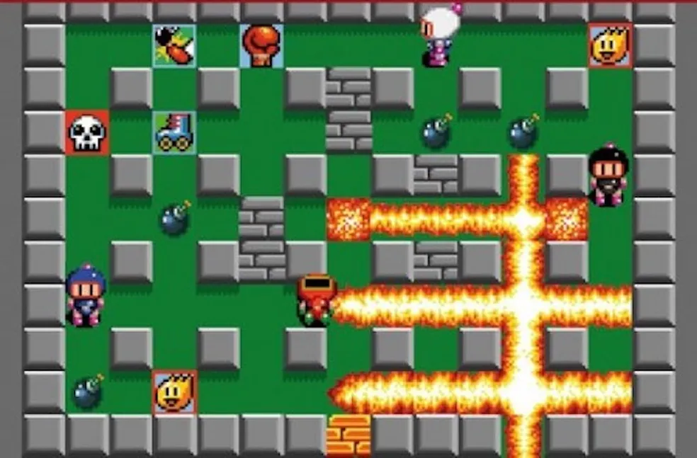
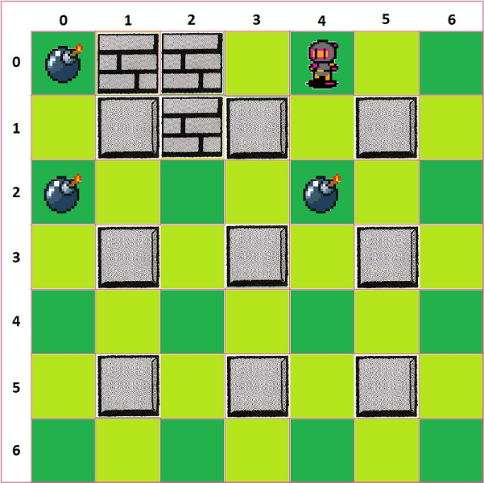
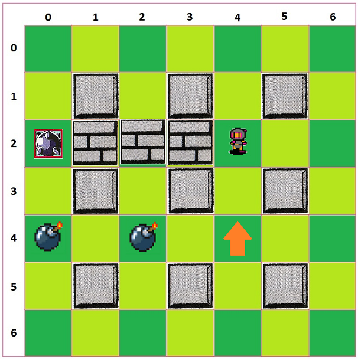

# Bomberman con Rust

Contexto
Bomberman es una franquicia de videojuegos originalmente desarrollada por Hudson Soft en 1983 para PC, y posteriormente para Famicon. Esta franquicia ha tenido un gran éxito en Japon, aunque este no es tan grande en Occidente. Bomberman ha sido la mascota de Hudson Soft a lo largo de toda su historia, hasta su absorción por parte de Konami en 2012.



Su sistema de juego es sencillo: Bomberman (si, el nombre del protagonista es el mismo que el del juego) debe atravesar un laberinto repleto de rocas y paredes, mientras se enfrenta a diversos enemigos. Para acabar con ellos, Bomberman dispone de bombas que, al ser detonadas, explotan emitiendo una ráfaga de fuego en direcciones verticales y horizontales. Si la ráfaga de fuego alcanza a uno de los enemigos, este es brutalmente incinerado derrotado. Para ganar, Bomberman debe derrotar a todos los enemigos del laberinto.

Bomberman cuenta con diferentes PowerUps que permiten mejorar distintos aspectos de sus bombas, como el alcance de la ráfaga de fuego, la cantidad de bombas que se pueden plantar a la vez, entre otras (volveremos a hablar de esto mas adelante).

## Ejercicio
Dado un laberinto de NxN dimensiones, que dispone de una serie de objetos en sus diferentes posiciones (bombas, paredes, etc.), se debe determinar, detonando una bomba en determinada posición, el estado FINAL del laberinto.

Una posición puede contener uno de los siguientes objetos (o en su defecto estar vacía):

- Enemigo: el enemigo que debe derrotarse con una ráfaga de fuego. Un enemigo puede tener desde 1 hasta 3 puntos de vida (es decir, que si tiene 2 puntos de vida, requiere ser impactado por 2 ráfagas diferentes para ser derrotado).
- Bomba: una bomba plantada en el suelo sin detonarse aún. Si una bomba es alcanzada por la ráfaga de otra bomba, entonces esta es detonada y explota generando su propia ráfaga. Cada bomba extenderá su ráfaga en direcciones horizontales y verticales, con un alcance fuego X mayor a 0.
- Roca: una roca que bloquea la ráfaga de fuego de las bombas ordinarias.
- Pared: una pared que bloquea la rafaga de fuego de todos los tipos de bombas.
- Desvio: un desvio que cambia la dirección de una ráfaga, sin modificar su alcance.


Las bombas pueden ser de diferentes tipos:
- Normales: simplemente detonan en direcciones verticales y horizontales (arriba, abajo, derecha e izquierda). Si se encuentran con una roca o una pared, la ráfaga es bloqueada.
En el juego original, las bombas de traspaso destruyen las rocas al ser alcanzadas por su rafaga. Para simplificar nuestro modelo, nuestras bombas normales no destruiran las rocas.
- De traspaso: las bombas de traspaso funcionan igual que las normales, con la diferencia de que su rafaga puede atravesar rocas sin perder alcance.
En el juego original, las bombas de traspaso destruyen las rocas al ser alcanzadas por su rafaga. Para simplificar nuestro modelo, nuestras bombas de traspaso solo atravesaran la roca (sin destruirla).

## Formato del laberinto
El laberinto se compone de N filas de N casilleros (donde N es un numero arbitrario mayor a 1) que pueden contener (o no) un objeto. Para cada fila del tablero, cada casillero se encuentra separado por un espacio [ ].

Para identificar cada objeto se utilizará la siguiente convención (X,Y) donde:

- X sera el objeto: Enemigo [F], Bomba normal [B], Bomba de traspaso [S], Roca [R], Pared [W], Desvio [D].
- Y sera (si corresponde):
    - En caso del Enemigo, sus puntos de vida.
    - En caso de la Bomba, el alcance de su rafaga.
    - En caso del Desvio, la dirección a la que se desvia la rafaga: Izquierda [L], Derecha [R], Arriba [U], Abajo [D].

Cualquier casilla vacia sera representada con guion bajo [_].

## Ejemplos

### Ejemplo 1
```
B2 R R _ F1 _ _
_ W R W _ W _
B5 _ _ _ B2 _ _
_ W _ W _ W _
_ _ _ _ _ _ _
_ W _ W _ W _
_ _ _ _ _ _ _
```



Si detonamos la bomba en la coordenada (0, 0), que posee un alcance de 2, la rafaga impactara sobre la bomba en (0, 2) con alcance de 5, la cual impactara en la bomba con coordenada en (4, 2) con alcance 2, que finalmente impactara en el enemigo (que posee 1 vida), derrotandolo.

Finalmente, el escenario resultante sera:
```
_ R R _ _ _ _
_ W R W _ W _
_ _ _ _ _ _ _
_ W _ W _ W _
_ _ _ _ _ _ _
_ W _ W _ W _
_ _ _ _ _ _ _
```

### Ejemplo 2
```
_ _ B2 _ B1 _ _
_ W _ W _ W _
_ _ B2 R F1 _ _
_ W _ W R W _
_ _ B4 _ _ _ _
_ W _ W _ W _
_ _ _ _ _ _ B1
```

Si detonamos la bomba en (2, 4), el camino de bombas detonadas sera:

(2, 4) -> (2, 2) -> (2, 0) -> (4, 0)

Donde:

La bomba en (2, 2) no impactará al enemigo debido a la roca entre ellos.
La bomba en (4, 0), como tiene alcance 1, tampoco llegará a impactar al enemigo.
La bomba en (6, 6) no sera detonada.
Finalmente, el escenario resultante sera:

```
_ _ _ _ _ _ _
_ W _ W _ W _
_ _ _ R F1 _ _
_ W _ W R W _
_ _ _ _ _ _ _
_ W _ W _ W _
_ _ _ _ _ _ B1
```

### Ejemplo 3
```
_ _ _ _ _ _ _
_ W _ W _ W _
S4 R R R F2 _ _
_ W _ W _ W _
B2 _ B5 _ DU _ _
_ W _ W _ W _
_ _ _ _ _ _ _
```

Si detonamos la bomba en (0, 4), los caminos de bombas detonadas seran:

(0, 4) -> (0, 2) (0, 4) -> (2, 4)

Donde:

La rafaga de la bomba de traspaso en (0, 2) atravesara todas las rocas, impactando en el enemigo
La rafaga de la bomba en (2, 4) sera desviada hacia arriba en la posicion (4, 4), provocando que impacte en el enemigo.
Finalmente, el escenario resultante sera:
```
_ _ _ _ _ _ _
_ W _ W _ W _
_ R R R _ _ _
_ W _ W _ W _
_ _ _ _ DU _ _
_ W _ W _ W _
_ _ _ _ _ _ _
```

## Formato de input
El input consiste en un archivo en el filesystem con el formato del laberinto, junto con la coordenada de la bomba que se quiere detonar primero.

## Formato de output
El output consiste en un archivo en el filesystem (con el mismo nombre que el archivo de input), localizado en el segundo parametro de invocacion del programa, donde debera guardarse el estado del laberinto de luego de haber detonado la bomba. En caso de no existir el archivo, este debera ser creado.

En caso de que un error ocurriese, se deberá escribir en el archivo un mensaje de error con el siguiente formato: ERROR: [descripcion_del_error].

## Invocacion del programa
La invocacion del programa debera incluir como parametros (en el siguiente orden):

1. La ruta al archivo de input.
2. La ruta a la carpeta/directorio de output.
3. La coordenada X de la primera bomba a denotar.
4. La coordenada Y de la primera bomba a denotar.

```
cargo run -- maze.txt /path/to/output_dir/ x y
```